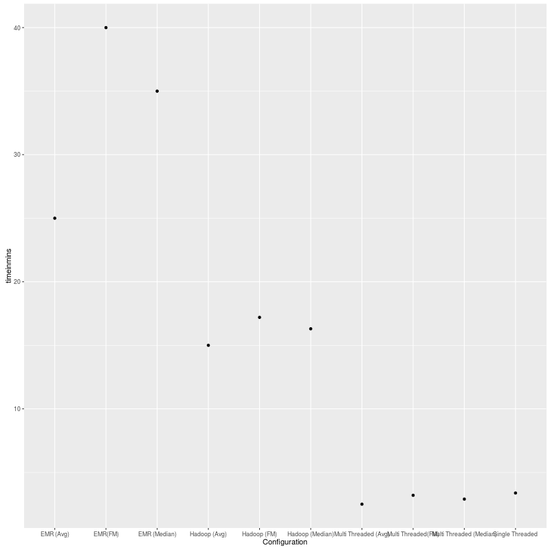

# Cluster Analysis,Comparison Report ############################################################  
 TEAM MEMBERS -> SARITA JOSHI and SHARMODEEP SARKAR  
 
#IMPLEMENTATION :  

 This project provides 12 configurations for mean, median, fast median for below infrastructures--

#	Sequential JAVA program
#	Multi-threaded JAVA program
#	Pseudo distributed environment
#	AWS cluster environment

 This project runs in a hadoop environnment with a mapper and reducer framework. For a dataset with 25 files, we have 25 Mappers working in this infrastructure and the default reducer as 1. We have even te sted our framework with 4 reducers by setting the no of reducers (setNumReducer(4))
 After the shuffling and sorting activities internally, the end result is the key with month, Carrier and values as eiher Median or Mean or Fast Median with total number of flights. This entire data is for flights active in 2015 only.

 PACKAGES USED :  
 	 R  
	 knitr  
	 markdown  
	 sbt  

 TECHNICAL DETAILS:

 Please follow the guidlines in the readme provided with the submission. It elaborates on the setup, execution and compilation procedure.  

 We have made use of Makefile and the rules within so that the rules help us to automate the entire procedure.  
 ---- make pseudo // This rule runs our code in a HDFS environment.  
 -----make emr // This rule runs our code in a EMR cluster setup.  

 ANALYSIS and CONCLUSION :   

This time analysis shows that the threaded version of the code runs the fastest and beats the sequential version by a narrow margin. The reason is , the time taken to spawn the threads took some time before they started to work concurrently. Hence the sequential version worked in around 3.5 mins while the threaded version required around 2.5 (for avg) to 3.2 mins for the Fast Median. We used the Quick Select algorithm for the Fast Median Calculation and it should have taken actually lesser time than the normal median but out guess is the internal function calls among the functions for calculating the median caused some over head and slowed it down.

Coming to the hadoop versions, the pseudo-distributed mode takes around 15 minutes (precisely 15 mins for avg, 16.3 mins for median and 17.2 mins for fast median). This is evident because we have done the configuration on our normal laptop (4 GB  RAM). The approximate time for running the code on the cluster is around 25 mins. This is in total with the cluster set up and start up. 

Inspite of these results, in the real world for huge data sets professional clusters like AWS should run the fastest, followed by pseudo-distributed hadoop (on machines with high computing and visualizing power), followed by threaded version and the highest time would be consumed by the sequential version.

 GRAPHICAL PRESENTATION:  

TIME GRAPH: 

GRAPH: 

